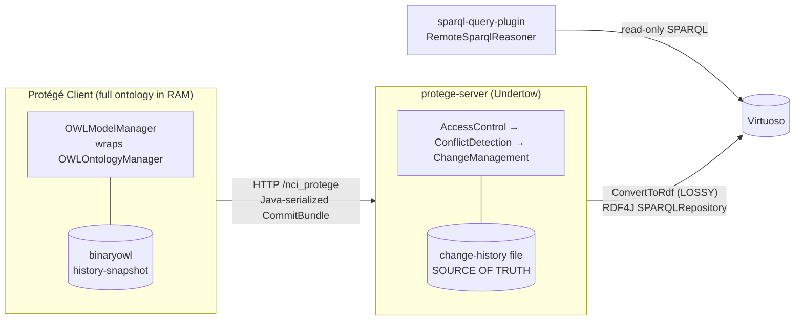

# Architecture Review: Migrating Clients to a Direct Virtuoso RDF Store

## Goal being evaluated

Move away from the current client-server design (clients load a full serialized OWL snapshot into RAM and sync with the protege-server via revision-numbered changesets) toward one where:

- Clients interact **directly** with the RDF Virtuoso triple store, so the entire ontology no longer needs to be in RAM at once.
- The **OWL API layer is removed**, while **keeping the OWL format for input/output serialization**.
- `nci-curator` (a classifier that needs the whole ontology in memory) is addressed separately, later.

## Current architecture, in one picture



The key thing to internalize: **Virtuoso is currently a lossy, one-way, read-only projection.** The authoritative store is the binaryowl snapshot + change-history file on the server. The proposed design inverts this — Virtuoso becomes the read/write source of truth — and that inversion is where almost all the friction lives.

## What sticks out

### 1. The OWL→RDF write path is lossy and one-way — this is the #1 blocker

`ConvertToRdf` in `protege/protege-editor-owl/src/main/java/org/protege/editor/owl/server/http/handlers/HTTPChangeService.java` (around lines 184–280) is an `OWLAxiomVisitor` that handles exactly **three** axiom shapes:

- `OWLDeclarationAxiom` → only `rdf:type owl:Class` (object/data/annotation properties, individuals, datatypes are dropped)
- `OWLAnnotationAssertionAxiom` → only literal values (IRI-valued annotations dropped)
- `OWLSubClassOfAxiom` → named superclass, or a single `ObjectSomeValuesFrom` with named property + named filler

Everything else — equivalent classes, disjointness, object/data property axioms, nested class expressions, imports, datatypes, language tags, individuals — is **silently discarded**. It also assumes a single `ncit:` namespace and derives predicates from `IRI.getShortForm()` (`buildCompQuery`), so it cannot represent a general OWL ontology.

This is fine for its actual job (feeding ad-hoc NCIt queries), but it means the RDF in Virtuoso **cannot round-trip back to OWL**. For the target design you need a complete, standards-based OWL-to-RDF mapping (the W3C OWL 2 RDF mapping) so that what a client writes is exactly what any client can read back. That is a full rewrite of this component, not an extension.

### 2. OWL API is the runtime data model, not an I/O layer — "remove the OWL API layer" is the largest item by far

Quantified: ~**2,900** `org.semanticweb.owlapi.model` imports across ~1,000 files. The entire contract of `protege/protege-editor-owl/src/main/java/org/protege/editor/owl/model/OWLModelManager.java` is OWL API types (`OWLOntology`, `OWLOntologyManager`, `OWLDataFactory`, `OWLAxiom`, `OWLReasoner`, `OWLOntologyChange`). Every UI panel, hierarchy provider, frame section, renderer, and plugin (`nci-edit-tab`, `lucene-search-tab`, `revision-history`) consumes those objects directly.

Only a thin sliver is genuinely I/O-only and cleanly separable — this is the part to *keep*:

- `protege/protege-editor-owl/src/main/java/org/protege/editor/owl/model/io/OntologySaver.java` / `OntologyLoader.java`
- the format implementations vendored in `owlapi/parsers`, `owlapi/rio`, `owlapi/oboformat`, plus `binaryowl`

So "keep OWL format for I/O, drop the OWL API layer" really means: **introduce a new abstraction to replace `OWLModelManager`/`OWLOntology` as the in-memory model**, backed by Virtuoso queries instead of an `OWLOntologyManager`, while still using the OWL API parsers/storers only at the import/export boundary. That new model interface is the central design artifact; everything downstream depends on it.

### 3. Nothing today does lazy/partial loading — the whole point of the migration has no foothold yet

`buildVersionedOntology` / `loadSnapShot` in `protege/protege-editor-owl/src/main/java/org/protege/editor/owl/client/LocalHttpClient.java` (around lines 571–700) deserialize the entire ontology into an `OWLOntologyImpl` up front, then fast-forward with changes. There is no notion of "fetch class X and its neighbors on demand." Every consumer assumes `getActiveOntology()` returns a fully-materialized ontology and iterates it freely (hierarchy providers, entity finders, Lucene indexing). A Virtuoso-backed lazy model must satisfy those same access patterns via SPARQL — the hierarchy providers and `lucene-search-tab`'s change-driven indexing are the places that will fight a lazy model hardest.

### 4. The whole concurrency model is revision-number optimistic locking — it disappears in the new design

Commit-blocking is enforced by comparing `commitBundle.getBaseRevision()` to the server head in `protege/protege-editor-owl/src/main/java/org/protege/editor/owl/server/conflict/ConflictDetectionFilter.java` (around lines 38–60), with client polling in `.../client/action/EnableAutoUpdateAction.java` and merge/rebase in `.../client/action/UpdateAction.java`.

If clients write straight to Virtuoso, you lose: the linear revision history, the "must be at latest to commit" guarantee, conflict detection, and the change-history audit trail. Virtuoso/SPARQL 1.1 Update gives no equivalent transactionality or per-edit provenance out of the box. **You need to decide what replaces revisions** — graph-level versioning, RDF-star provenance, an external transaction/lock service, or keeping a slimmer commit-coordination service in front of Virtuoso. This is a policy decision, not a code detail, and it affects `metaproject` (access control) too.

### 5. Transport uses Java native serialization — a rewrite opportunity and a security liability

Commits/changes cross the wire as `ObjectOutputStream`/`ObjectInputStream` of `CommitBundle`, `ChangeHistory`, `DocumentRevision` (`LocalHttpClient.commit`, `HTTPChangeService.handlingRequest`). Moving to a SPARQL-endpoint model deletes this protocol entirely — good, because untrusted Java deserialization is a well-known RCE vector (OWASP A08).

### 6. Security debt in the current write path that must not be carried forward

`buildAnonParentQuery` / `buildCompQuery` build SPARQL Update by string-concatenating IRIs and literal values (`HTTPChangeService.java`, around lines 82–188) — literal values are interpolated with raw `"` quoting and no escaping. That is a SPARQL-injection / broken-data hazard today, and in a client-writes-directly world every client becomes an injection surface. The new mapping layer must use parameterized/programmatic RDF (RDF4J `Statement`/`Update` builders, proper literal escaping, full IRIs not short forms) rather than string building.

### 7. `nci-curator` is correctly the one thing to defer

Confirmed: it is a bespoke in-memory structural classifier (a Pellet-derived graph-walker, not a DL tableaux reasoner) in `nci-curator/src/main/java/gov/nih/nci/curator/owlapi/KnowledgeBase.java` that stores the whole `OWLOntology` and walks it. It is genuinely separable from the rest and can keep loading a full snapshot (via the OWL parsers being kept) even after everyone else goes lazy. It is also the one component that *is* a legitimate consumer of the full OWL API model, so it will anchor whatever OWL-API-based path is retained.

## Suggested framing of the work

Roughly in dependency order:

1. **Define a complete, bidirectional OWL 2 ↔ RDF mapping** and make it the single write/read contract for Virtuoso (replacing `ConvertToRdf`). This is prerequisite to everything.
2. **Introduce a new model abstraction** to stand in for `OWLModelManager`/`OWLOntology`, backed by SPARQL, keeping the OWL API only behind `OntologyLoader`/`OntologySaver` for file import/export.
3. **Decide the concurrency/provenance replacement** for revision numbers + `ConflictDetectionFilter` before removing the server.
4. **Port the hardest consumers** — hierarchy providers and `lucene-search-tab` — to the lazy model; they encode the "whole ontology in RAM" assumption most deeply.
5. **Leave `nci-curator` on a full-load path** and detach it last.

## Key files referenced

| Concern | File |
|---|---|
| Lossy OWL→RDF write path | `protege/protege-editor-owl/src/main/java/org/protege/editor/owl/server/http/handlers/HTTPChangeService.java` |
| Core in-memory model contract | `protege/protege-editor-owl/src/main/java/org/protege/editor/owl/model/OWLModelManager.java` |
| Full-snapshot load / no lazy loading | `protege/protege-editor-owl/src/main/java/org/protege/editor/owl/client/LocalHttpClient.java` |
| Revision-based conflict detection | `protege/protege-editor-owl/src/main/java/org/protege/editor/owl/server/conflict/ConflictDetectionFilter.java` |
| Client polling of server revision | `protege/protege-editor-owl/src/main/java/org/protege/editor/owl/client/action/EnableAutoUpdateAction.java` |
| Update/sync merge | `protege/protege-editor-owl/src/main/java/org/protege/editor/owl/client/action/UpdateAction.java` |
| I/O boundary to keep | `protege/protege-editor-owl/src/main/java/org/protege/editor/owl/model/io/OntologySaver.java`, `OntologyLoader.java` |
| Vendored format parsers to keep | `owlapi/parsers`, `owlapi/rio`, `owlapi/oboformat`, `binaryowl` |
| Read-side Virtuoso query plugin | `sparql-query-plugin/src/main/java/org/protege/editor/owl/rdf/RemoteSparqlReasoner.java` |
| In-memory classifier (defer) | `nci-curator/src/main/java/gov/nih/nci/curator/owlapi/KnowledgeBase.java` |

---

# Design decisions — commit-coordination service (2026-09-04 session)

This section records decisions made after grounding the review in `nci-edit-tab`, `metaproject`, and `evs-history`. It supersedes the earlier open question in finding #4 ("what replaces revisions").

## Decision 1: Keep a slim commit-coordination service in front of Virtuoso

Clients do **not** write to Virtuoso directly. A "commit" in this system is a **semantic transaction**, not an axiom. `merge()`, `completeRetire()`, and `splitClass()` in `nci-edit-tab/.../NCIEditTab.java` each assemble a `List<OWLOntologyChange>`, apply it atomically, and wrap it in a `CommitBundleImpl(baseRevision, commit)`. Writing those add/remove triples straight to Virtuoso with SPARQL 1.1 Update would lose the atomic boundary, and a half-applied merge/retire is a data-integrity failure.

The service keeps the `CommitBundle` as the transaction unit and wire contract, but its internals are rewritten:

- Replace Java native serialization (`ObjectInputStream`/`ObjectOutputStream` of `CommitBundle`/`ChangeHistory`) — an untrusted-deserialization RCE liability (OWASP A08) — with a typed JSON/protobuf change payload.
- Translate the accepted transaction into a **complete, non-lossy OWL 2 → RDF** write into Virtuoso (replacing the lossy `ConvertToRdf`).
- Virtuoso becomes the **fact store**; the service remains the **system of record for transactions**.

Responsibilities the service must own (none of which raw Virtuoso/SPARQL provide):

| Responsibility | Where it lives today |
|---|---|
| Atomic multi-axiom transaction | `CommitBundle` apply |
| Optimistic concurrency | `ConflictDetectionFilter` (baseRevision vs head) |
| Permission enforcement | `AccessControlFilter` → `metaproject.isOperationAllowed(op, project, user)` |
| Workflow gating (pre-merge / pre-retire approval) | pre-state roots + marker annotations |
| EVS history + audit | `CodeGenHandler.recordEvsHistory` |

## Decision 2: Workflow/approval state stays as data in the graph

The modeler→manager approval state is already stored as **ontology data, not server session state**. A pre-merge is `SubClassOf(source, PRE_MERGE_ROOT)` plus `MERGE_TARGET`/`MERGE_SOURCE` annotations; `isPreMerged(cls)` is just `isSubClass(cls, PRE_MERGE_ROOT)` (same pattern for `PRE_RETIRE_ROOT`). This maps directly and losslessly into RDF, so the workflow state travels in the triple store for free.

The service therefore does **not** need a separate approval queue/database — it needs to **enforce the legal transitions**:

- Modeler → may add `PRE_MERGE_ROOT` / `PRE_RETIRE_ROOT` edges (gated by the relevant `metaproject` operation).
- Manager (`mp-project-manager` → `isWorkFlowManager()`) → may promote pre-state to `RETIRE_ROOT`, run reference retargeting, set `deprecated`.

The existing `AccessControlFilter` change→operation mapping (`AddAxiom`→`ADD_AXIOM`, plus custom `RETIRE` / `UNRETIRE` / `UNMERGE`) is reused largely as-is.

## Decision 3: Entity-scoped optimistic concurrency (replaces global revision head)

The revision-number scheme is effectively a single global lock. Replace it with **per-concept optimistic versioning**: each concept subgraph carries a version/ETag (hash of its defining triples, or a monotonic per-concept counter maintained by the service). A transaction declares the concepts it read/wrote and their observed versions; the service accepts only if none moved. Two modelers on unrelated concepts never conflict — the common case.

Refresh-without-chattiness uses the same version: instead of polling a global revision (`EnableAutoUpdateAction`), the editor subscribes to / long-polls a **change feed of `(conceptCode, newVersion)`** and refreshes only the concepts currently open or visible.

### Blast radius is wider than first characterized — merges AND retirements

Correction to the initial analysis (which treated RETIRE as touching only the retired class): **both merge and retirement have a two-directional blast radius.** They modify:

- **Outbound**: the classes the retiring/merging class points to **through object properties (roles)** — role fillers are **retargeted** where possible, and annotations such as `OLD_SOURCE_ROLE` (and the analogous deprecation markers) are added to preserve the prior role assertions.
- **Inbound**: the classes that **point to** the retiring/merging class — references are retargeted (merge) or deprecated/annotated (retire) via `ReferenceReplace.retargetRefs(...)` scanning `getReferencingAxioms(...)`.

So the true write-set of a merge or retire is:

```
{ subject } ∪ referencingClasses(subject) ∪ roleFillerClasses(subject)
```

Implications for the concurrency model:

- The declared write-set for merge/retire must be **expanded to this inbound+outbound closure**, and the service takes a short **wide lock / multi-concept version check** over the whole closure — not just the retired concept.
- This is acceptable because merges and finalized retirements are **manager-gated and infrequent**; everyday modeler edits (MODIFY, CREATE, SPLIT) stay narrow.
- The change feed must emit version bumps for **every concept in the closure**, so open editors on an inbound/outbound neighbor refresh correctly (e.g. a class whose role filler was just retargeted, or that received an `OLD_SOURCE_ROLE` annotation).

Decision to pin down: the **unit of versioning** (concept subgraph — recommended, matches edit granularity — vs. named-graph-per-concept vs. global) drives both the conflict check and the refresh feed.

## Decision 4: `nci-curator` consumes a materialized logical projection

The curator only needs the **logical axioms** — named classes, `SubClassOf` (named superclass or single `ObjectSomeValuesFrom(role, filler)`), equivalences, and the role hierarchy — never annotations. `KnowledgeBase` walks an object graph; it does not need OWL API richness.

- Define the projection precisely and materialize it with a **bounded SPARQL query** against Virtuoso (no full-ontology scan).
- **Build it server-side, next to the triple store** (not per-client), maintained incrementally from the same accepted-commit stream the coordination service already processes — logical-axiom changes patch the graph; annotation-only edits are ignored. Note: role-filler retargeting from a merge/retire (Decision 3) **is** a logical-axiom change and must patch the projection.
- Serialize as a compact binary snapshot (reuse `binaryowl`) and serve on demand, stamped with per-concept versions.
- Keep the projection **derived and disposable** (a cache keyed by concept version), never authoritative — otherwise there are two sources of truth.

This isolates the one remaining legitimate OWL-API consumer behind a narrow "logical model" service so the rest of the migration need not keep the curator's needs in scope.

## EVS history survives the migration nearly unchanged

EVS history is already **decoupled from axioms** — records are keyed on `code / name / operation / reference` derived from UI intent, not from `OWLOntologyChange` inspection (`CodeGenHandler.recordEvsHistory`, appended as tab-delimited text). The only change is that its trigger moves from the **client post-commit** to the **service's accept-commit callback**.

## Open decisions carried forward

1. **Transaction ↔ RDF atomicity** (highest risk): how the service makes a multi-axiom OWL transaction atomic against Virtuoso — staging graph + swap, or a single SPARQL Update request with rollback discipline.
2. **Versioning unit**: concept subgraph vs. named-graph-per-concept vs. global (drives conflict check + refresh feed).
3. **Provenance model** replacing `ChangeHistory`: RDF-star, a reified change graph, or a side ledger in the service.
4. **EVS history trigger point**: confirm moving the hook to the service accept-commit callback is acceptable.

## Decisions key files

| Concern | File |
|---|---|
| Complex ops (split/merge/retire) + batch/commit | `nci-edit-tab/src/main/java/gov/nih/nci/ui/NCIEditTab.java` |
| Inbound/outbound reference + role-filler retargeting | `nci-edit-tab/src/main/java/gov/nih/nci/utils/ReferenceReplace.java` |
| Pre-state roots, permission ids, `OLD_SOURCE_ROLE`/dep annotations | `nci-edit-tab/src/main/java/gov/nih/nci/ui/NCIEditTabConstants.java` |
| Server-side permission enforcement at commit | `protege/protege-editor-owl/src/main/java/org/protege/editor/owl/server/policy/AccessControlFilter.java` |
| Authorization check | `metaproject/src/main/java/edu/stanford/protege/metaproject/impl/ServerConfigurationImpl.java` (`isOperationAllowed`) |
| Predefined + custom operations | `metaproject/src/main/java/edu/stanford/protege/metaproject/impl/Operations.java` |
| EVS history record + persistence | `protege/protege-editor-owl/src/main/java/org/protege/editor/owl/server/http/handlers/CodeGenHandler.java`, `.../server/http/messages/History.java` |
