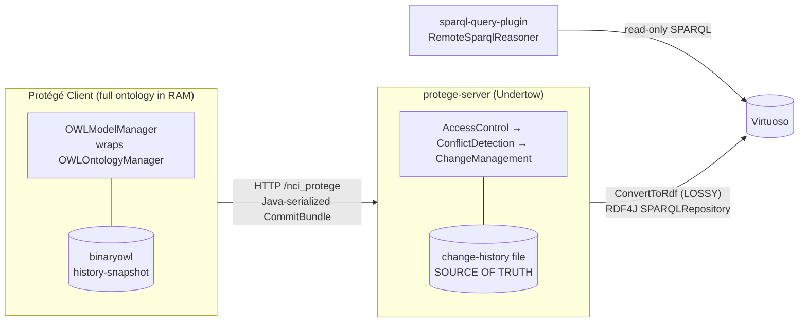

# Architecture Review: Migrating Clients to a Direct Virtuoso RDF Store

## Goal being evaluated

Move away from the current client-server design (clients load a full serialized OWL snapshot into RAM and sync with the protege-server via revision-numbered changesets) toward one where:

- Clients interact **directly** with the RDF Virtuoso triple store, so the entire ontology no longer needs to be in RAM at once.
- The **OWL API layer is removed**, while **keeping the OWL format for input/output serialization**.
- `nci-curator` (a classifier that needs the whole ontology in memory) is addressed separately, later.

## Current architecture, in one picture



The key thing to internalize: **Virtuoso is currently a lossy, one-way, read-only projection.** The authoritative store is the binaryowl snapshot + change-history file on the server. The proposed design inverts this — Virtuoso becomes the read/write source of truth — and that inversion is where almost all the friction lives.

## What sticks out

### 1. The OWL→RDF write path is lossy and one-way — this is the #1 blocker

`ConvertToRdf` in `protege/protege-editor-owl/src/main/java/org/protege/editor/owl/server/http/handlers/HTTPChangeService.java` (around lines 184–280) is an `OWLAxiomVisitor` that handles exactly **three** axiom shapes:

- `OWLDeclarationAxiom` → only `rdf:type owl:Class` (object/data/annotation properties, individuals, datatypes are dropped)
- `OWLAnnotationAssertionAxiom` → only literal values (IRI-valued annotations dropped)
- `OWLSubClassOfAxiom` → named superclass, or a single `ObjectSomeValuesFrom` with named property + named filler

Everything else — equivalent classes, disjointness, object/data property axioms, nested class expressions, imports, datatypes, language tags, individuals — is **silently discarded**. It also assumes a single `ncit:` namespace and derives predicates from `IRI.getShortForm()` (`buildCompQuery`), so it cannot represent a general OWL ontology.

This is fine for its actual job (feeding ad-hoc NCIt queries), but it means the RDF in Virtuoso **cannot round-trip back to OWL**. For the target design you need a complete, standards-based OWL-to-RDF mapping (the W3C OWL 2 RDF mapping) so that what a client writes is exactly what any client can read back. That is a full rewrite of this component, not an extension.

### 2. OWL API is the runtime data model, not an I/O layer — "remove the OWL API layer" is the largest item by far

Quantified: ~**2,900** `org.semanticweb.owlapi.model` imports across ~1,000 files. The entire contract of `protege/protege-editor-owl/src/main/java/org/protege/editor/owl/model/OWLModelManager.java` is OWL API types (`OWLOntology`, `OWLOntologyManager`, `OWLDataFactory`, `OWLAxiom`, `OWLReasoner`, `OWLOntologyChange`). Every UI panel, hierarchy provider, frame section, renderer, and plugin (`nci-edit-tab`, `lucene-search-tab`, `revision-history`) consumes those objects directly.

Only a thin sliver is genuinely I/O-only and cleanly separable — this is the part to *keep*:

- `protege/protege-editor-owl/src/main/java/org/protege/editor/owl/model/io/OntologySaver.java` / `OntologyLoader.java`
- the format implementations vendored in `owlapi/parsers`, `owlapi/rio`, `owlapi/oboformat`, plus `binaryowl`

So "keep OWL format for I/O, drop the OWL API layer" really means: **introduce a new abstraction to replace `OWLModelManager`/`OWLOntology` as the in-memory model**, backed by Virtuoso queries instead of an `OWLOntologyManager`, while still using the OWL API parsers/storers only at the import/export boundary. That new model interface is the central design artifact; everything downstream depends on it.

### 3. Nothing today does lazy/partial loading — the whole point of the migration has no foothold yet

`buildVersionedOntology` / `loadSnapShot` in `protege/protege-editor-owl/src/main/java/org/protege/editor/owl/client/LocalHttpClient.java` (around lines 571–700) deserialize the entire ontology into an `OWLOntologyImpl` up front, then fast-forward with changes. There is no notion of "fetch class X and its neighbors on demand." Every consumer assumes `getActiveOntology()` returns a fully-materialized ontology and iterates it freely (hierarchy providers, entity finders, Lucene indexing). A Virtuoso-backed lazy model must satisfy those same access patterns via SPARQL — the hierarchy providers and `lucene-search-tab`'s change-driven indexing are the places that will fight a lazy model hardest.

### 4. The whole concurrency model is revision-number optimistic locking — it disappears in the new design

Commit-blocking is enforced by comparing `commitBundle.getBaseRevision()` to the server head in `protege/protege-editor-owl/src/main/java/org/protege/editor/owl/server/conflict/ConflictDetectionFilter.java` (around lines 38–60), with client polling in `.../client/action/EnableAutoUpdateAction.java` and merge/rebase in `.../client/action/UpdateAction.java`.

If clients write straight to Virtuoso, you lose: the linear revision history, the "must be at latest to commit" guarantee, conflict detection, and the change-history audit trail. Virtuoso/SPARQL 1.1 Update gives no equivalent transactionality or per-edit provenance out of the box. **You need to decide what replaces revisions** — graph-level versioning, RDF-star provenance, an external transaction/lock service, or keeping a slimmer commit-coordination service in front of Virtuoso. This is a policy decision, not a code detail, and it affects `metaproject` (access control) too.

### 5. Transport uses Java native serialization — a rewrite opportunity and a security liability

Commits/changes cross the wire as `ObjectOutputStream`/`ObjectInputStream` of `CommitBundle`, `ChangeHistory`, `DocumentRevision` (`LocalHttpClient.commit`, `HTTPChangeService.handlingRequest`). Moving to a SPARQL-endpoint model deletes this protocol entirely — good, because untrusted Java deserialization is a well-known RCE vector (OWASP A08).

### 6. Security debt in the current write path that must not be carried forward

`buildAnonParentQuery` / `buildCompQuery` build SPARQL Update by string-concatenating IRIs and literal values (`HTTPChangeService.java`, around lines 82–188) — literal values are interpolated with raw `"` quoting and no escaping. That is a SPARQL-injection / broken-data hazard today, and in a client-writes-directly world every client becomes an injection surface. The new mapping layer must use parameterized/programmatic RDF (RDF4J `Statement`/`Update` builders, proper literal escaping, full IRIs not short forms) rather than string building.

### 7. `nci-curator` is correctly the one thing to defer

Confirmed: it is a bespoke in-memory structural classifier (a Pellet-derived graph-walker, not a DL tableaux reasoner) in `nci-curator/src/main/java/gov/nih/nci/curator/owlapi/KnowledgeBase.java` that stores the whole `OWLOntology` and walks it. It is genuinely separable from the rest and can keep loading a full snapshot (via the OWL parsers being kept) even after everyone else goes lazy. It is also the one component that *is* a legitimate consumer of the full OWL API model, so it will anchor whatever OWL-API-based path is retained.

## Suggested framing of the work

Roughly in dependency order:

1. **Define a complete, bidirectional OWL 2 ↔ RDF mapping** and make it the single write/read contract for Virtuoso (replacing `ConvertToRdf`). This is prerequisite to everything.
2. **Introduce a new model abstraction** to stand in for `OWLModelManager`/`OWLOntology`, backed by SPARQL, keeping the OWL API only behind `OntologyLoader`/`OntologySaver` for file import/export.
3. **Decide the concurrency/provenance replacement** for revision numbers + `ConflictDetectionFilter` before removing the server.
4. **Port the hardest consumers** — hierarchy providers and `lucene-search-tab` — to the lazy model; they encode the "whole ontology in RAM" assumption most deeply.
5. **Leave `nci-curator` on a full-load path** and detach it last.

## Key files referenced

| Concern | File |
|---|---|
| Lossy OWL→RDF write path | `protege/protege-editor-owl/src/main/java/org/protege/editor/owl/server/http/handlers/HTTPChangeService.java` |
| Core in-memory model contract | `protege/protege-editor-owl/src/main/java/org/protege/editor/owl/model/OWLModelManager.java` |
| Full-snapshot load / no lazy loading | `protege/protege-editor-owl/src/main/java/org/protege/editor/owl/client/LocalHttpClient.java` |
| Revision-based conflict detection | `protege/protege-editor-owl/src/main/java/org/protege/editor/owl/server/conflict/ConflictDetectionFilter.java` |
| Client polling of server revision | `protege/protege-editor-owl/src/main/java/org/protege/editor/owl/client/action/EnableAutoUpdateAction.java` |
| Update/sync merge | `protege/protege-editor-owl/src/main/java/org/protege/editor/owl/client/action/UpdateAction.java` |
| I/O boundary to keep | `protege/protege-editor-owl/src/main/java/org/protege/editor/owl/model/io/OntologySaver.java`, `OntologyLoader.java` |
| Vendored format parsers to keep | `owlapi/parsers`, `owlapi/rio`, `owlapi/oboformat`, `binaryowl` |
| Read-side Virtuoso query plugin | `sparql-query-plugin/src/main/java/org/protege/editor/owl/rdf/RemoteSparqlReasoner.java` |
| In-memory classifier (defer) | `nci-curator/src/main/java/gov/nih/nci/curator/owlapi/KnowledgeBase.java` |

---

# Design decisions — commit-coordination service (2026-09-04 session)

This section records decisions made after grounding the review in `nci-edit-tab`, `metaproject`, and `evs-history`. It supersedes the earlier open question in finding #4 ("what replaces revisions").

## Decision 1: Keep a slim commit-coordination service in front of Virtuoso

Clients do **not** write to Virtuoso directly. A "commit" in this system is a **semantic transaction**, not an axiom. `merge()`, `completeRetire()`, and `splitClass()` in `nci-edit-tab/.../NCIEditTab.java` each assemble a `List<OWLOntologyChange>`, apply it atomically, and wrap it in a `CommitBundleImpl(baseRevision, commit)`. Writing those add/remove triples straight to Virtuoso with SPARQL 1.1 Update would lose the atomic boundary, and a half-applied merge/retire is a data-integrity failure.

The service keeps the `CommitBundle` as the transaction unit and wire contract, but its internals are rewritten:

- Replace Java native serialization (`ObjectInputStream`/`ObjectOutputStream` of `CommitBundle`/`ChangeHistory`) — an untrusted-deserialization RCE liability (OWASP A08) — with a typed JSON/protobuf change payload.
- Translate the accepted transaction into a **complete, non-lossy OWL 2 → RDF** write into Virtuoso (replacing the lossy `ConvertToRdf`).
- Virtuoso becomes the **fact store**; the service remains the **system of record for transactions**.

Responsibilities the service must own (none of which raw Virtuoso/SPARQL provide):

| Responsibility | Where it lives today |
|---|---|
| Atomic multi-axiom transaction | `CommitBundle` apply |
| Optimistic concurrency | `ConflictDetectionFilter` (baseRevision vs head) |
| Permission enforcement | `AccessControlFilter` → `metaproject.isOperationAllowed(op, project, user)` |
| Workflow gating (pre-merge / pre-retire approval) | pre-state roots + marker annotations |
| EVS history + audit | `CodeGenHandler.recordEvsHistory` |

## Decision 2: Workflow/approval state stays as data in the graph

The modeler→manager approval state is already stored as **ontology data, not server session state**. A pre-merge is `SubClassOf(source, PRE_MERGE_ROOT)` plus `MERGE_TARGET`/`MERGE_SOURCE` annotations; `isPreMerged(cls)` is just `isSubClass(cls, PRE_MERGE_ROOT)` (same pattern for `PRE_RETIRE_ROOT`). This maps directly and losslessly into RDF, so the workflow state travels in the triple store for free.

The service therefore does **not** need a separate approval queue/database — it needs to **enforce the legal transitions**:

- Modeler → may add `PRE_MERGE_ROOT` / `PRE_RETIRE_ROOT` edges (gated by the relevant `metaproject` operation).
- Manager (`mp-project-manager` → `isWorkFlowManager()`) → may promote pre-state to `RETIRE_ROOT`, run reference retargeting, set `deprecated`.

The existing `AccessControlFilter` change→operation mapping (`AddAxiom`→`ADD_AXIOM`, plus custom `RETIRE` / `UNRETIRE` / `UNMERGE`) is reused largely as-is.

## Decision 3: Entity-scoped optimistic concurrency (replaces global revision head)

The revision-number scheme is effectively a single global lock. Replace it with **per-concept optimistic versioning**: each concept subgraph carries a version/ETag (hash of its defining triples, or a monotonic per-concept counter maintained by the service). A transaction declares the concepts it read/wrote and their observed versions; the service accepts only if none moved. Two modelers on unrelated concepts never conflict — the common case.

Refresh-without-chattiness uses the same version: instead of polling a global revision (`EnableAutoUpdateAction`), the editor subscribes to / long-polls a **change feed of `(conceptCode, newVersion)`** and refreshes only the concepts currently open or visible.

### Blast radius is wider than first characterized — merges AND retirements

Correction to the initial analysis (which treated RETIRE as touching only the retired class): **both merge and retirement have a two-directional blast radius.** They modify:

- **Outbound**: the classes the retiring/merging class points to **through object properties (roles)** — role fillers are **retargeted** where possible, and annotations such as `OLD_SOURCE_ROLE` (and the analogous deprecation markers) are added to preserve the prior role assertions.
- **Inbound**: the classes that **point to** the retiring/merging class — references are retargeted (merge) or deprecated/annotated (retire) via `ReferenceReplace.retargetRefs(...)` scanning `getReferencingAxioms(...)`.

So the true write-set of a merge or retire is:

```
{ subject } ∪ referencingClasses(subject) ∪ roleFillerClasses(subject)
```

Implications for the concurrency model:

- The declared write-set for merge/retire must be **expanded to this inbound+outbound closure**, and the service takes a short **wide lock / multi-concept version check** over the whole closure — not just the retired concept.
- This is acceptable because merges and finalized retirements are **manager-gated and infrequent**; everyday modeler edits (MODIFY, CREATE, SPLIT) stay narrow.
- The change feed must emit version bumps for **every concept in the closure**, so open editors on an inbound/outbound neighbor refresh correctly (e.g. a class whose role filler was just retargeted, or that received an `OLD_SOURCE_ROLE` annotation).

Decision to pin down: the **unit of versioning** (concept subgraph — recommended, matches edit granularity — vs. named-graph-per-concept vs. global) drives both the conflict check and the refresh feed.

## Decision 4: `nci-curator` consumes a materialized logical projection

The curator only needs the **logical axioms** — named classes, `SubClassOf` (named superclass or single `ObjectSomeValuesFrom(role, filler)`), equivalences, and the role hierarchy — never annotations. `KnowledgeBase` walks an object graph; it does not need OWL API richness.

- Define the projection precisely and build it **server-side, next to the triple store** (not per-client) from the compacted state at squash time. It is logical-only; annotation-only edits are irrelevant to it. Note: role-filler retargeting from a merge/retire (Decision 3) **is** a logical-axiom change and so does affect the projection (it is picked up on replay). First-pass production/consumption mechanics are in the refinement below.
- Serialize as a compact binary snapshot (reuse `binaryowl`) and serve on demand, stamped with the head revision it reflects.
- Keep the projection **derived and disposable** (a checkpoint rebuilt at squash, plus replayed delta), never authoritative — otherwise there are two sources of truth.

This isolates the one remaining legitimate OWL-API consumer behind a narrow "logical model" service so the rest of the migration need not keep the curator's needs in scope.

### Refinement (2026-09-09): base graph + changeset replay, keyed by revision

First-pass mechanics for how the projection is produced and consumed, replacing "continuously materialize via SPARQL" with a checkpoint + replay model that reuses the changeset spine:

- **Squash writes the logical base graph.** The logical object graph is a checkpoint artifact emitted at squash time (alongside the new empty changeset and the evs/concept-history backups). Between squashes the base-graph file is immutable.
- **Classify = base graph + replayed committed delta.** On a classification request the server curator loads the base graph, then replays the changesets accumulated since the last squash, then runs `KnowledgeBase`. No full ontology is ever in RAM (except the logical-only graph, server-side).
- **Replay is logical-axiom-only.** Changesets carry everything (annotations, synonyms, EVS qualifiers); the curator applies only the logical subset (declarations, `SubClassOf`, `EquivalentClasses`, object-property/role axioms) and ignores annotation-only changes. Since the overwhelming majority of edits are annotation changes, the *logical* delta between squashes is small — which is why replay-on-demand is cheap and the on-disk graph does **not** need per-commit maintenance on the first pass.
- **Keyed by revision.** The curator replays changesets **up to the current head revision** — the same boundary Virtuoso has applied — so curator results and Virtuoso queries stay consistent and results are reproducible/cacheable by revision.
- **Pre-commit classification is the one open question.** Today the curator runs client-side and therefore classifies the modeler's *uncommitted* work. Server-side "base + committed delta" only sees committed state, so to classify work-in-progress the request must carry the client's **pending changeset** as an extra delta: `classify(base graph + committed delta up to head + client pending logical delta)`. This makes the classification endpoint take an optional pending-changes payload rather than being purely stateless-by-revision — a decision to pin down.
- **Deferred:** rewriting the on-disk graph after a classification (memoization). First pass stays stateless — base + replay every time — until the next squash rewrites the base. Revisit only if the logical delta ever grows enough to matter.

Net: **squash writes the logical base graph; classify = base graph + committed delta (+ optional client pending delta), logical axioms only, replayed server-side, keyed by revision.** The curator remains the single component allowed to hold a full (logical-only) graph in memory, server-side, without dragging the rest of the system back to whole-ontology-in-RAM.

## Decision #4: EVS history folds into the commit (2026-09-10)

EVS history is **decoupled from axioms** — records are keyed on `code / name / operation / reference` derived from UI intent, not from `OWLOntologyChange` inspection (`CodeGenHandler.recordEvsHistory`, appended as tab-delimited text). Today the client records it in a **second** call (`putEVSHistory`) after the commit and before broadcasting `CommitOperationEvent` — two separate transactions, so a failure between them leaves a committed change with no EVS record, unrecoverable because the operation type is UI intent, not inferable from the axioms.

Decision: **carry the EVS operation descriptor inside the commit bundle** (in `RevisionMetadata`), so the server records EVS history **inside the same `synchronized` commit section** that appends the changeset and applies Virtuoso. One transaction, one failure domain.

- The **changeset log is the single source of truth**; `evs_history` becomes a **derived, replay-recoverable projection** of the log — like Virtuoso — caught up to head via the last-applied-revision marker. `concept_history` is already derived from `evs_history` (`CodeGenHandler.generateConceptHistory`), so it follows for free. A crash cannot desync them: replay the log and every projection catches up.
- The client still supplies the EVS intent (it already computes it in `submitHistory`); it just moves from a second call into the commit payload.
- The client-side `CommitOperationEvent` broadcast is replaced by **lazy feed refresh**: other clients refresh from the changeset feed + Virtuoso; the committing client advances its head (its own Lucene index already reflects its edits). EVS is recorded server-side **before** the new revision is exposed in the feed, preserving today's “record before broadcast” ordering.
- Squash still backs up `evs_history` / `concept_history` at the checkpoint (they are projections, so this is a convenience snapshot, not a separate source of truth).
- Fallback (not chosen): keep EVS as a post-commit call and tolerate the pre-existing low-frequency inconsistency.

# The changeset log is the spine (2026-09-09 clarification)

Correcting the earlier framing that treated the change-history mainly as an audit trail: the **append-only changeset log is the central data structure of the collaborative system** and must be kept. It is a per-revision, append-only list of `OWLOntologyChange` (Add/RemoveAxiom, plus import / annotation / ontology-id changes) grouped into commits, each with a `RevisionMetadata` (author, timestamp, comment), serialized with `BinaryOWLOntologyChangeLog` (`ChangeHistoryImpl`, `ChangeHistoryUtils`, `Commit`; appended server-side by `ChangeManagementFilter` → `changePool.appendChanges`).

## Decision (provenance — was open #3): keep the changeset log, add an OWL↔RDF transform

The provenance model is **decided**: keep the append-only OWL-axiom changeset log rather than replacing it with RDF-star or a reified change graph. It is not merely audit — it is load-bearing for:
- **Manager review** — the `revision-history` plugin browses changesets per author / date / subject (`LogDiff`, `LogDiffManager`, `ChangeHistoryPanel`, `AuthorPanel`, `CommitPanel`).
- **Conflict detection** — server-side `ConflictDetectionFilter` (base-revision vs head → `OutOfSyncException`) and client-side `SimpleConflictDetector` (same-type-and-annotation-property strategy) via `LogDiff.findConflits`.
- **Abort / reject and undo** — `ReviewManagerImpl.getReviewOntologyChanges` / `getReverseChange` reverse rejected changes (Add↔Remove) and commit them as a `[Review]` changeset; this is also how `unretire`/`unmerge` reconstruct their undo (reverse the original commit's changes).

The one addition the migration requires: changesets must be **transformable into and out of RDF**, so the same append-only OWL add/remove log can (a) stay the authoritative provenance ledger + undo substrate, and (b) drive incremental updates into Virtuoso.

## New commit flow

1. Client commits a changeset (bundle of OWL add/remove axioms) → coordination service.
2. Service enforces policy + conflict check, then **appends the changeset to the log** (unchanged).
3. Service **transforms the changeset's OWL changes → RDF triple add/removes and applies them to Virtuoso** (the new step; Virtuoso becomes current-state truth).
4. Other modelers see the change through Virtuoso (lazy queries) and by **consuming the changeset stream** for local refresh + Lucene indexing (below).

## Squash (periodic compaction) is kept

Roughly weekly a manager compacts the log (`revision-history` → `ReviewButtonsPanel.squashHistoryBtnListener` → `LocalHttpClient.squashHistory` → `HTTPChangeService.squashHistory`):
- **Pause the server** (`HTTPServer.isPaused`; during squash only commit / squash / latest-changes are allowed) so no one edits.
- Archive the old `history` (changeset log), `history-snapshot`, and checksum under `squash-{timestamp}/`; create a **fresh empty changeset file**; write a **new snapshot baseline** (`serverLayer.saveProjectSnapshot`, binaryowl) + checksum; clear the history cache.
- Back up `evs_history` and `concept_history` at the same checkpoint.

Implication for the snapshot: the binaryowl **snapshot survives here** — as the server-side squash *baseline/backup* and the seed for (re)loading Virtuoso and building the curator projection — **not** as the per-client full-ontology RAM load, which the Virtuoso lazy model retires. So binaryowl is kept for two things: the **changeset log** (`BinaryOWLOntologyChangeLog`) and the **squash snapshot baseline** (plus the curator's logical-projection blob, Decision 4).

## Clients still consume the changeset stream — for Lucene and refresh

`lucene-search-tab` builds its client-side index (`~/.protege/lucene-search-tab/indexes/<id>/`) and keeps it current by listening to `OWLOntologyChange` events: `LuceneSearchManager` registers an `OWLOntologyChangeListener`; `updateIndex` routes each change through `AddChangeSetHandler` / `RemoveChangeSetHandler` (indexing `ENTITY_IRI`, `DISPLAY_NAME`, `ENTITY_TYPE`, and annotation `ENTITY_IRI` / `ANNOTATION_IRI` / `ANNOTATION_TEXT`; SearchTab variants add logical-axiom fields). Today those events come from applying server-synced changesets to the in-memory ontology.

In the Virtuoso model the full ontology is no longer in RAM, so **the changeset stream itself must feed the indexer** — the add/remove axioms carry exactly the entity IRIs + annotation text the index needs. This makes the changeset feed a first-class client input (driving both Lucene maintenance and open-editor refresh), replacing the "apply changes to the whole in-RAM ontology" trigger.

## Retirement/merge blast radius (reinforcing the concurrency discussion)

Reconfirmed in `NCIEditTab` retirement logic: retiring a class rewrites **both directions** —
- **outbound**: classes it points to via object-property roles/associations — role fillers are retargeted where possible and `OLD_SOURCE_ROLE` / `DEP_ROLE` / `DEP_ASSOC` annotations added;
- **inbound**: classes that point to it — references retargeted/deprecated via `ReferenceReplace.retargetRefs` over `getReferencingAxioms`.

A single retire/merge commit therefore legitimately mutates many classes. The changeset already **bundles all of those add/removes into one commit**, and conflict detection operates over the whole bundle — which is why the **changeset-based conflict model is the natural fit** (not a separate per-concept lock). Entity-scoped versioning (open decision #2) is at most an optional optimization for the *refresh feed*, not a replacement for changeset-level conflict detection.

# The server is the transaction boundary for Virtuoso (2026-09-10 decision)

Resolves open decision #1. The commit path already serializes writes, so the transaction boundary is the protégé server's commit critical section — not Virtuoso, which needs no multi-statement ACID.

- **Commits are already serialized.** `ConflictDetectionFilter.commit` is `synchronized`: it reads the server head revision, rejects the commit if `baseRevision < head` (`OutOfSyncException`), otherwise delegates to append. The append path (`ChangeDocumentPool.appendChanges` / `lookupHead`) is `synchronized` too. So the check-then-append is atomic and single-threaded across all clients.
- **Add the Virtuoso apply inside that section.** After `super.commit` appends the changeset and assigns the new revision, transform the changeset's OWL add/removes to RDF and apply to Virtuoso before releasing the lock. Virtuoso writes inherit the serialization and land in revision order.
- **Log stays authoritative; Virtuoso is a recoverable projection.** Guard a mid-write crash with a **"last-applied revision" marker** stored in/beside Virtuoso; on startup, if `marker < log head`, replay the missing changesets. Idempotent and self-healing — Virtuoso never has to be transactionally perfect, only catchable-up from the log. This is the crux: no distributed transaction anywhere.
- **Apply each changeset as one SPARQL 1.1 Update** (`DELETE DATA … ; INSERT DATA …`), which Virtuoso executes atomically — the single place the OWL→RDF changeset transform is used on the write path.
- **Preconditions:** the server must be the **sole writer** to Virtuoso (clients read-only via SPARQL), and the lock must be a genuine single serialization point. Note the standing `// TODO: head revision is checked here, but another thread may already be proceeding to do a commit` above the check — `synchronized` only serializes with **one** `ConflictDetectionFilter` instance per project; harden to a single instance / shared per-project commit lock before relying on it for Virtuoso writes.
- **Granularity:** commits are serialized one at a time per project. The accept/reject predicate is **per-class** (Decision #2 below); a rejected commit still never interleaves, and Virtuoso applies stay in serialized revision order, so the boundary argument holds regardless of the gate's granularity.

## Write-path security — clients read-only, server the only writer

Confirmed against the dev Virtuoso (2026-09-10): the anonymous `/sparql` endpoint **accepts SPARQL Update** (an anonymous `INSERT DATA` returned 200). Combined with clients being able to change the endpoint URL (`SPARQLPreferences`, client-side), a client could write directly to the store — violating the “server is the sole writer” precondition of Decision #1. Enforce before go-live:
- **Virtuoso-side endpoint separation is the real guard** (not client trust): expose a **read-only** endpoint to clients (grant only `SPARQL_SELECT` to the anonymous SPARQL role) and put updates behind an **authenticated** endpoint (`/sparql-auth`) whose credentials only the server holds.
- The server write path (`owl-virtuoso.SparqlStore`) uses the **metaproject-sourced** endpoint (`TRIPLESTORE` config) + graph (project `namespace/name`), never client preferences — mirroring `HTTPChangeService` (endpoint at line 302, graph at line 418, gated by `UPDATE_TRIPLE_STORE`).
- Optionally, `sparql-query-plugin` should validate its loaded query list as read-only and reject SPARQL `UPDATE` (it uses `prepareQuery` today, which is query-only).

# Decision #2: per-class commit gate (2026-09-10)

Chosen over the global `base == head` gate. The commit stays serialized (transaction-boundary decision above), but the **accept/reject predicate becomes per-class**, so modelers editing disjoint areas commit concurrently without a full re-sync.

- **Refresh and gate are separate concerns.** Refresh is per-class in all cases: the client consumes the changeset feed, each changeset names the classes it touched, so the client marks open/edited classes stale and lazy-refetches them from Virtuoso. No full ontology in RAM. The gate is only the server's commit-time check.
- **The gate predicate.** A commit carries a `baseRevision` (the head the client had processed) plus the set of classes its changeset touches (the subjects of its add/remove axioms — the client already knows them). Inside the `synchronized` commit section the server checks: did any touched class change in the interval `(baseRevision, head]`? If none → accept; if some → reject and return the conflicting classes. This replaces “reject if `base != head`” with “reject only if a class I touched moved under me.”
- **Server-side state:** a per-class **last-changed revision** index, updated as each accepted changeset is appended (its touched classes get the new revision number). It is derivable/rebuildable from the changeset log — an index over the log, not a new source of truth.
- **Touched set = the blast radius.** For a retire/merge the touched classes are the whole inbound+outbound closure the changeset already bundles (role-filler retargets, `OLD_SOURCE_ROLE`, `ReferenceReplace`), so the gate automatically protects every class the commit mutates and rejects if any moved. The changeset-bundles-the-blast-radius property and the per-class gate line up exactly.
- **Serialization unchanged.** Commits are still processed one at a time and applied to Virtuoso in revision order; only the predicate changed. Correctness holds because the touched-class check still forbids committing an edit built on a stale class (a `RemoveAxiom` against an axiom that moved).
- **Finer conflict feedback.** Rejections name the specific stale classes (vs. today's blanket “out of sync, do update”), so the client refreshes only those and the modeler reconciles locally.

## Open decisions carried forward

1. **Transaction ↔ RDF atomicity** — **DECIDED**: the protégé server's `synchronized` commit critical section is the transaction boundary. Apply each accepted changeset to Virtuoso as one SPARQL Update in revision order, with a last-applied-revision marker + replay from the authoritative log for crash recovery. Not a Virtuoso distributed transaction. (See “The server is the transaction boundary for Virtuoso” above.)
2. **Versioning unit** — **DECIDED**: per-class commit gate. A commit carries `baseRevision` + the touched-class set; the server rejects only if a touched class changed in `(baseRevision, head]`, using a per-class last-changed-revision index over the changeset log. The same per-class staleness signal (from the changeset feed) drives open-editor refresh and lazy refetch. (See “Decision #2: per-class commit gate” above.)
3. **Provenance model** — **DECIDED**: keep the append-only OWL-axiom changeset log (`BinaryOWLOntologyChangeLog`) as the authoritative ledger + undo substrate, and add an OWL↔RDF transform so the same changesets drive Virtuoso. Not RDF-star. (See “The changeset log is the spine” above.)
4. **EVS history trigger point** — **DECIDED**: the EVS descriptor rides in the commit bundle; the server records `evs_history` inside the commit section, making it (and `concept_history`) replay-recoverable projections of the log; the client-side broadcast is replaced by lazy feed refresh. (See “Decision #4: EVS history folds into the commit” above.)

## Decisions key files

| Concern | File |
|---|---|
| Complex ops (split/merge/retire) + batch/commit | `nci-edit-tab/src/main/java/gov/nih/nci/ui/NCIEditTab.java` |
| Inbound/outbound reference + role-filler retargeting | `nci-edit-tab/src/main/java/gov/nih/nci/utils/ReferenceReplace.java` |
| Pre-state roots, permission ids, `OLD_SOURCE_ROLE`/dep annotations | `nci-edit-tab/src/main/java/gov/nih/nci/ui/NCIEditTabConstants.java` |
| Server-side permission enforcement at commit | `protege/protege-editor-owl/src/main/java/org/protege/editor/owl/server/policy/AccessControlFilter.java` |
| Authorization check | `metaproject/src/main/java/edu/stanford/protege/metaproject/impl/ServerConfigurationImpl.java` (`isOperationAllowed`) |
| Predefined + custom operations | `metaproject/src/main/java/edu/stanford/protege/metaproject/impl/Operations.java` |
| EVS history record + persistence | `protege/protege-editor-owl/src/main/java/org/protege/editor/owl/server/http/handlers/CodeGenHandler.java`, `.../server/http/messages/History.java` |
| Changeset log (append-only OWL changes) | `protege/protege-editor-owl/src/main/java/org/protege/editor/owl/server/versioning/ChangeHistoryImpl.java`, `ChangeHistoryUtils.java`, `Commit.java`; `binaryowl` `BinaryOWLOntologyChangeLog` |
| Server-side commit append | `protege/protege-editor-owl/src/main/java/org/protege/editor/owl/server/change/ChangeManagementFilter.java` |
| Conflict detection (server / client) | `protege/protege-editor-owl/src/main/java/org/protege/editor/owl/server/conflict/ConflictDetectionFilter.java`; `revision-history/src/main/java/org/protege/editor/owl/client/diff/model/SimpleConflictDetector.java`, `LogDiff.java` |
| Manager review + reject/undo | `revision-history/src/main/java/org/protege/editor/owl/client/diff/model/ReviewManagerImpl.java`, `.../diff/ui/ReviewButtonsPanel.java` |
| Squash (pause + compact + new baseline) | `protege/protege-editor-owl/src/main/java/org/protege/editor/owl/server/http/handlers/HTTPChangeService.java` (`squashHistory`), `.../server/http/HTTPServer.java` (`isPaused`) |
| Snapshot serialize/load (baseline + curator) | `protege/protege-editor-owl/src/main/java/org/protege/editor/owl/server/api/ServerLayer.java` (`saveProjectSnapshot`), `.../client/LocalHttpClient.java` (`loadSnapShot`) |
| Client Lucene index driven by changes | `lucene-search-tab/src/main/java/org/protege/editor/search/lucene/LuceneSearchManager.java`, `AddChangeSetHandler.java`, `RemoveChangeSetHandler.java` |
